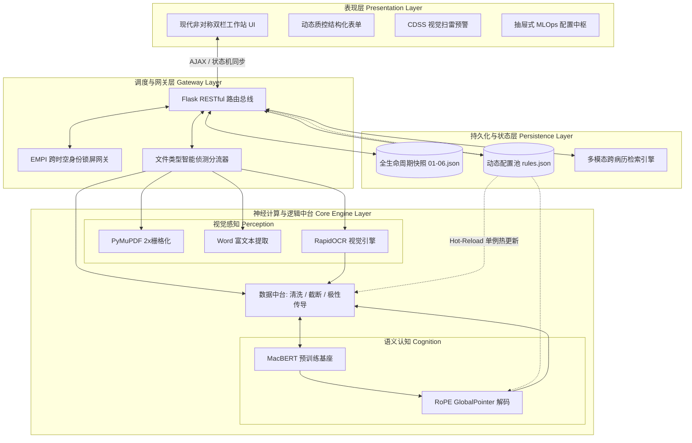
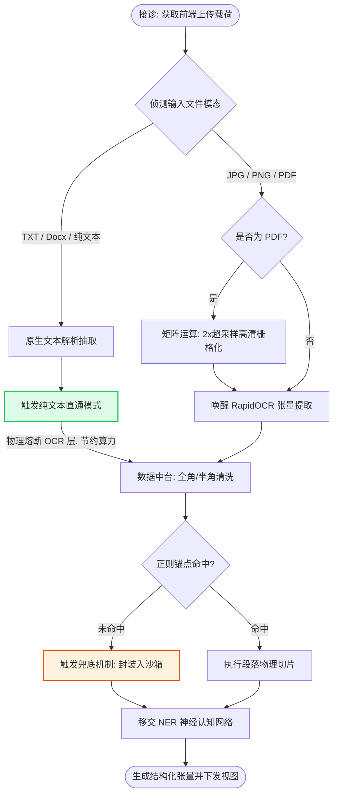
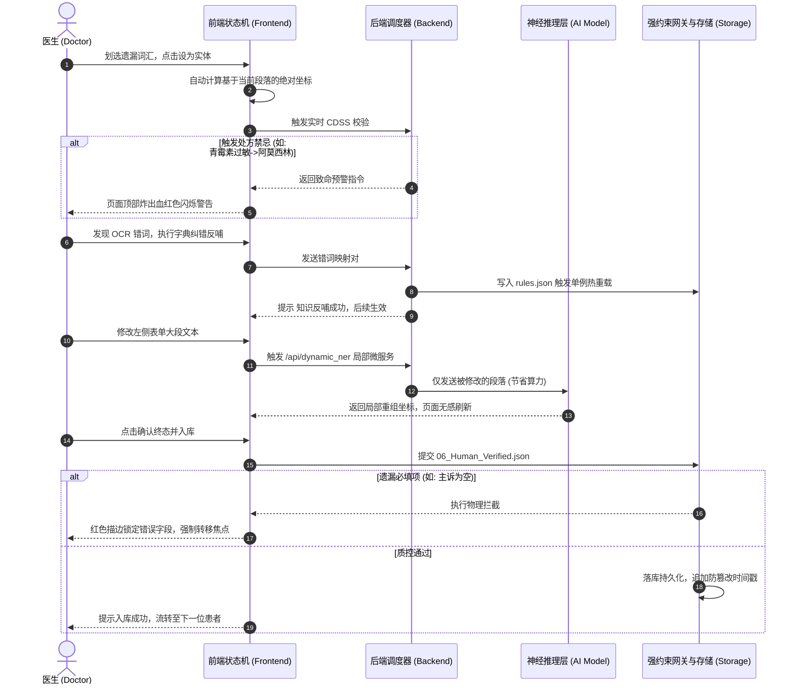

> ### 重要声明 (Disclaimer)
>
> **本项目仅作为学术研究与毕业设计作品，旨在展示人工智能（NLP）算法落地逻辑、人机协同架构与医疗信息化工程，不具备任何实际医疗用途。**
>
> - **非临床建议**：系统生成的推断结论（如用药目的、临床结论等）均基于预训练模型与专家规则，未经临床验证，**严禁**直接用于真实医疗诊断、用药指导或治疗建议。
> - **学术研究性质**：本项目所有识别结果、推断逻辑仅供学术交流与技术探讨使用，使用者需承担因误用而产生的风险。
> - **数据隐私**：请勿将含有真实敏感个人信息的病历上传至任何公共环境。
>
> **This project is for academic demonstration purposes ONLY and is NOT intended for actual clinical use or medical diagnosis.**

---

# 医疗病历智能感知与人机协同中枢

**(Medical EMR Intelligence & Human-in-the-Loop System)**

[](https://www.python.org/)
[](https://pytorch.org/)
[](https://flask.palletsprojects.com/)
[](https://opensource.org/licenses/MIT)

本项目是一个基于深度学习（**MacBERT + RoPE GlobalPointer**）与**动态规则引擎**双驱架构的现代化医疗 NLP 工作站。专为非结构化临床文本（手写/打印病历、PDF 报告、电子文档）设计，探索了 AI 算法在垂直行业落地的工程化范式。

**核心亮点：**

- **多模态全兼容**：支持图片 OCR 视觉感知与 PDF/Docx/TXT 纯文本极速直通。
- **精准语义认知**：解决医疗长文本实体嵌套难题，内置极性逻辑推演（阴性/阳性体征判定）。
- **工业级 MLOps**：包含动态配置热重载、EMPI 患者网关、CDSS 高危拦截与防篡改归档机制。
- **沉浸式交互**：摒弃黑盒输出，打造类 IDE 的“划词干预-实时重载”人机协同（HITL）闭环。

---

## 一、 项目目的与意义 (Project Purpose & Significance)

1. **规范化基层医疗数据资产**：针对非结构化的手写/打印病历，提供低门槛的数字化与结构化解决方案，解决纸质病历易丢失、难检索的痛点。
2. **打通院际信息孤岛**：将杂乱的文本转化为标准结构化 JSON 数据，方便向更高级别医院转院时的病史精准查阅与系统级数据对接。
3. **突破静态 AI 落地局限（核心探索）**：传统的 AI 模型在部署后往往成为“黑盒”，本项目通过引入**主动学习（Active Learning）**与**动态配置**机制，探索了一条轻量级医疗 AI 系统的持续演化路径，有效降低了模型在垂直领域的水土不服。

---

## 二、 核心工程架构与技术壁垒 (Core Engineering Innovations)

本项目摒弃了传统 AI 模型“只管识别、不管业务”的孤岛模式，将算法表现层与医疗业务逻辑深度融合，构筑了以下四大核心技术基柱：

### 2.1 双模态智能感知与深度语义网络 (Dual-Modal Perception & Deep Cognition)

> **技术栈**: `RapidOCR` | `PyMuPDF` | `MacBERT + RoPE GlobalPointer` | `极性辖域传导`

- **多模态全兼容与智能熔断**：系统原生集成图文双轨解析。支持 PDF/图片 的超采样栅格化 OCR，同时提供 Word/TXT 的“纯文本闪电直通车”——物理熔断庞大的视觉感知层，实现毫秒级直通 NER 认知计算。
- **复杂语境精准解构**：底层采用注入了旋转位置编码（RoPE）的 GlobalPointer 网络，从数学维度彻底解决医疗长文本的“实体嵌套”难题；独创“基于枚举正则的极性传染算法”，沿着语法树精准传导“阴性/排除”状态，消灭传统模型在长连词句下的“假阳性”幻觉。

### 2.2 强约束质控与全栈 CDSS 拦截网关 (Clinical Quality Gate & CDSS)

> **技术栈**: `EMPI 跨时空继承` | `双向状态机监听` | `JSON 规则树碰撞`

- **无死角的高危预警防线**：前置 EMPI 网关自动寻址并**跨时空继承**老患者的历史过敏史。内嵌临床决策支持系统（CDSS），实时双向监听 AI 提取与人工手写的药物数据，一旦触发配伍禁忌，瞬间爆出血红色高压拦截警报。
- **底线级物理质控归档**：基于 `rules.json` 动态下发表单与必填项约束。医生签署终态归档时，若系统扫描到“主诉”或“初步诊断”等核心节点为空，将实施物理拦截并强制转移焦点，逼迫人工介入补充，确保落库的 `06_human_verified.json` 数据绝对合规。

### 2.3 类 IDE 沉浸式人机协同工作站 (Immersive Human-in-the-Loop)

> **技术栈**: `自适应弹性网格` | `DOM 坐标重组引擎` | `启发式智能摘要`

- **现代化非对称全景视口**：全面摒弃拥挤的后台管理网格，打造类似 VSCode 的“左侧聚合中枢 + 右侧沉浸工作区”布局。在纯文本直通模式下，系统动态销毁图像占位容器，将高亮映射区 100% 满宽自适应平铺。
- **毫秒级手术刀微操反馈**：首创“文本偏移隐式修复引擎”。医生可直接在原文划词增删实体，系统仅将修改的单段文本发往大模型进行**局部张量重载**，并自动重新对齐全篇绝对坐标，实现页面零闪烁的完美交互；系统生成的 AI 辅诊摘要支持一键点击注入草稿垫，打通“AI 提议 - 人工定夺”的最后一公里。

### 2.4 现代化 MLOps 与动态热重载中枢 (Dynamic MLOps Console)

> **技术栈**: `单例线程锁 (Threading.Lock)` | `GUI ⇆ JSON 双向序列化桥接`

- **摆脱硬编码的全局统治台**：在 Web 端实现平滑滑出的大型抽屉式配置中枢，统管算力调度配置、模型置信度阈值、OCR 纠错字典、动态 EMR 表单结构以及 CDSS 拦截规则。
- **零宕机 (Zero-Downtime) 规则演化**：支持傻瓜式可视化修改与高阶开发者纯 JSON 源码编辑。任何保存操作均依托底层的并发安全单例锁，在**不重启 Python 后端进程**的前提下瞬间执行内存级热重载，并自带“一键恢复出厂设置”的沙盒时光机功能。

---

## 三、 全栈系统架构与管线工作流 (Architecture & Workflows)

本系统采用高度解耦的微服务化流式（Streaming-Pipeline）设计。为全方位展示底层张量流转与业务编排，以下提供四个维度的核心架构图解（极具学术与工程参考价值）：

### 3.1 系统总体层级拓扑 (Overall System Architecture)

系统采用标准的四层架构，确保前端渲染、API 网关、AI 算力与底层存储的绝对物理隔离。



### 3.2 双模态智能分流管线 (Dual-Modal Pipeline Workflow)

针对不同类型的医疗数据载体，系统能够智能寻址并触发物理熔断，实现算力的最优化调配。



### 3.3 深度语义认知与极性推演流 (Deep Cognition & Polarity Flow)

展示从一段粗糙的文本到生成具备“阳性/阴性”逻辑属性的结构化实体的算法全过程。

```mermaid
graph LR
    Input(["原始段落切片"]) --> Tokenizer["BertTokenizerFast 编码"]
    Tokenizer --> |"input_ids, mask"| MacBERT["MacBERT 特征提取层"]
    MacBERT --> |"last_hidden_state"| Dense["Dense 降维投影"]
  
    Dense --> RoPE["注入 Sinusoidal 旋转位置编码"]
    RoPE --> Score["计算 Token-Pair 关联概率矩阵"]
    Score --> Threshold["置信度阈值过滤"]
  
    Threshold --> Filter["滤除无效 Padding 坐标"]
    Filter --> Nested["MLF 实体嵌套消解算法"]
  
    Nested --> Polarity["滑动窗口极性辖域扫描"]
    Polarity --> |"无/否认/未见"| Neg["标记为: 阴性或排除"]
    Polarity --> |"常规语境"| Pos["标记为: 阳性或确诊"]
  
    Neg --> Result(["输出高质量实体集"])
    Pos --> Result(["输出高质量实体集"])
  
    classDef rope fill:#e1f5fe,stroke:#0288d1,stroke-width:2px;
    class RoPE rope;
    classDef nested fill:#f3e5f5,stroke:#7b1fa2,stroke-width:2px;
    class Nested nested;
    classDef polarity fill:#ffebee,stroke:#c62828,stroke-width:2px;
    class Polarity polarity;
```



### 3.4 MLOps 人机协同与 CDSS 时序交互 (HITL & CDSS Sequence)\

抛弃 AI 黑盒，展示医生如何通过 UI 干预模型的输出，并触发底层的安全拦截网关。



---

## 四、 目录结构与模块深度解析 (Project Structure)

本项目严格遵循现代软件工程规范，实现了前后端分离、业务代码与配置解耦的底层架构设计。以下为本系统的完整物理工程目录树 :

```text
/Medical_EMR_Intelligence/         # 项目根目录
├── app/                           # 核心算子与后端控制逻辑层
│   ├── __init__.py                # 包声明文件
│   ├── config_manager.py          # [核心] 线程安全的单例动态配置总线
│   ├── exceptions.py              # 全局自定义异常捕获池
│   ├── model.py                   # PyTorch GlobalPointer 神经网络架构
│   ├── ner.py                     # MacBERT 认知与张量切片推理算子
│   ├── ocr.py                     # RapidOCR 多模态视觉感知提取算子
│   ├── processor.py               # 数据清洗、正则截断与极性传导逻辑中台
│   ├── storage.py                 # I/O 持久层、CDSS 碰撞与多模态检索引擎
│   └── train.py                   # 独立的神经认知层 Fine-tuning 微调脚本
│
├── configs/                       # 动态规则与热重载中枢
│   ├── global_settings.json       # 算力调度 (CPU/CUDA) 等系统级参数
│   ├── model.json                 # NER 阈值、标签映射字典 (id2label)
│   ├── rules.json                 # CDSS 拦截簇、纠错字典、动态表单渲染架构
│   └── *_default.json             # 各配置的沙盒备份（用于恢复出厂设置）
│
├── data/                          # 训练数据集存放区
│   └── cmeee_v2/                  # CMeEE-V2 医疗命名实体识别语料库
│
├── docs/                          # 项目文档区
│   └── API_REFERENCE.md           # 开发者 API 与底层接口参考手册
│
├── models/                        # 模型权重挂载区
│   └── ner_model.pt               # 基于医疗语料微调的本地张量权重
│
├── output/                        # 生产环境数据持久化归档区
│   └── patient_records/           # 自动生成的患者 EMPI 标识目录
│       └── PID_XXXXXX/            # 以哈希值隔离的患者终身档案
│           └── V_20260310_.../    # 就诊流水快照 (包含01源图至06核验库文件)
│
├── static/                        # 前端静态资产与交互脚本
│   ├── css/style.css              # 玻璃拟物态渲染规范与主题
│   └── js/main.js                 # 极其硬核的前端状态机与微操流转控制
│
├── templates/                     # 视图渲染层
│   └── index.html                 # 现代非对称双栏沉浸式工作站 UI
│
├── uploads_temp/                  # 运行时的多模态文件 (图片/PDF/文档) 临时缓存区
│
├── main.py                        # 基于 DAG 的双模态主调度器 (Pipeline 主入口)
├── web.py                         # Flask 宿主、API 路由网关与 PDF 栅格化挂载
├── requirement.txt                # 生产环境依赖清单
└── readme.md                      # 项目说明文档
```

---

## 五、 技术栈选型 (Tech Stack)

本项目在选型上兼顾了**学术前沿算法**与**工业级落地稳定性**，构建了极度解耦的全栈解决方案：

### AI 模型与算法层 (AI & Deep Learning)

- **深度学习框架**: `PyTorch 2.x`
- **预训练语言基座**: `HuggingFace Transformers` (`hfl/chinese-macbert-base`)
- **核心解码网络**: `GlobalPointer` (内嵌 `RoPE` 旋转位置编码，从数学底层降维打击实体嵌套与重叠问题)
- **多模态视觉感知**: `RapidOCR` (基于 `ONNXRuntime` 的极速轻量级推理，替代传统笨重的独立 OCR 服务)

### 后端调度与数据中台 (Backend & Data Ops)

- **微服务路由宿主**: `Flask` (RESTful API), `Werkzeug`
- **文档解析引擎**: `PyMuPDF (fitz)` (支持 PDF 矩阵运算与 2x 超采样栅格化), `python-docx` (Word 富文本提取)
- **底层状态与流转**: 基于 `Threading.Lock` 的并发安全单例模式，以及隐式绝对坐标漂移补偿算法

### 沉浸式前端工作站 (Frontend UI/UX)

- **布局与视觉骨架**: `Bootstrap 5`, `HTML5/CSS3`
- **交互与状态机引擎**: 原生 `Vanilla JavaScript (ES6)`, 采用 `SessionStorage` 实现跨路由防丢锁，引入 `ResizeObserver` 防治内存泄漏
- **设计语言**: `Glassmorphism` (现代磨砂玻璃拟物化视效), 弹性的跨设备响应式自适应网格

### 高阶工程化范式 (Advanced Engineering Paradigms)

- **零宕机 MLOps**: 内存级配置热重载 (Hot-Reloading)、`GUI ⇆ JSON` 双向绑定与无缝序列化
- **人机协同 (Human-in-the-Loop)**: 划词单段微服务重载、字典知识反哺闭环、AI 实体药丸 (Entity Chips) 一键注入
- **HIS 级业务风控体系**: EMPI 历史过敏档案跨时空继承、CDSS 实时高压禁忌预警、防篡改签名与归档强约束质控

---

## 六、  部署与使用指南 (Deployment & Usage)

### 6.1 环境准备 (Environment Setup)

本系统基于 **Python 3.9+** 构建，为避免环境冲突，强烈建议使用 Anaconda / Miniconda 创建独立的虚拟环境。

```bash
# 1. 克隆或下载本项目至本地
git clone [https://github.com/your-username/Medical_EMR_Intelligence.git](https://github.com/your-username/Medical_EMR_Intelligence.git)
cd Medical_EMR_Intelligence

# 2. 创建虚拟环境并激活
conda create -n emr_ai python=3.10
conda activate emr_ai

# 3. 安装核心运算与 Web 宿主依赖
pip install -r requirement.txt
```

### 6.2 模型装载

由于平台对大文件的限制，预训练模型及微调权重需自行挂载：

NER 张量权重：请确保已将微调后的 `ner_model.pt` 放置于项目根目录的 `/models/` 文件夹下。

NLP 预训练基座：系统首次运行前将自动从 HuggingFace 下载 `hfl/chinese-macbert-base`。

> **离线部署提示 (Offline Mode)**：若服务器处于内网物理隔离环境，请提前将 MacBERT 权重下载至本地，并在 Web 端设置中心的 `model.json` 面板中，将寻址路径更改为本地绝对路径。

### 6.3 启动智能中枢

在项目根目录执行以下命令唤起 Web 服务：

```bash
python web.py
```

当终端提示

```bash
* Running on all addresses (0.0.0.0)
* Running on http://127.0.0.1:5000
* Running on http://X.X.X.X:5000
```

时，表示神经计算图已构建完毕。使用现代浏览器（推荐 Chrome / Edge）访问 `http://127.0.0.1:5000/` 即可进入工作站。

### 6.4 交互演示与 MLOps 操作手册 (Workflow Walkthrough)

> [!IMPORTANT]
> **前置屏障：确立患者身份 (EMPI 网关)**
> 遵循真实 HIS 规范，进入系统后影像采集通道将处于**默认锁定**状态。必须首先点击左侧【确立/切换】弹出 EMPI 网关，提取历史患者或建档新患者。锁定身份后，工作站方可解锁并进入“绿灯就绪”状态。

#### 1.多模态数据采集与极性审查

* **影像感知 (Image Perception)**：上传包含医疗文本的 JPG/PNG 或 PDF 扫描件（底层引擎将自动提取 PDF 首页并进行 2x 矩阵高清放大渲染）。
* **文本直通 (Text Direct)**：直接上传 TXT/Word 文档，或在文本框中粘贴长文本。系统将闪电直通结构化认知层。
* **极性视觉映射**：在右侧【语义识别投影】区，**灰色且带有红色(排除)字样并划掉的实体**，代表被系统“极性传导引擎”判定为阴性历史（如：*否认高血压*）。

#### 2.沉浸式人机协同干预 (HITL Micro-ops)

* **划词新增 (Zero-Shot Entity)**：用鼠标划选任意遗漏文本，系统将在光标上方弹射【悬浮舱】。点击“设为实体”并选择类别，即可动态注入特征空间。
* **悬浮纠错 (Data Flywheel)**：划选 OCR 识别错误的乱码，点击“字典纠错”，输入正确词汇即可触发数据飞轮，永久反哺底层清洗规则库。
* **属性翻转**：点击任意已高亮的实体色块，即可在弹窗中一键修改其所属类别，或**一键翻转阴阳极性**。

#### 3.局部微服务流转与自适应重构

* **无感刷新重载**：点击任意段落右上角的 `[增删文本]` 进行修改。完成后点击 `[向下传导]`，系统**仅将修改后的单段文本**发往底层大模型进行局部张量重载，并自动对齐全篇的绝对坐标，实现页面零闪烁刷新。
* **CDSS 触发测试**：尝试人为将处方文本修改为“青霉素”，若病历既往史段落存在“青霉素过敏”字样，系统将瞬间拦截并爆出**血红色高危预警**。

#### 4.结构化复核与强约束归档 (Quality Gate)

* **实体一键采纳**：切换至【结构化复核】标签页，光标定位到左侧标准表单框。点击右侧悬浮的“AI 实体药丸（Chips）”，即可自动无缝拼接入表单，阴性实体将智能补充“无”字前缀。
* **AI 辅诊摘要**：在【逻辑入库】标签页，点击绿色“智能辅诊胶囊”，即可一键生成连贯的医学诊断草稿。
* **强临床约束拦截**：点击【确认终态并入库】时，若遗漏了配置字典中规定的必填项（如“主诉”或“过敏史”），**系统将被强制物理阻断并红色高亮警告**。校验通过后，生成带时间戳防篡改的 `06_Human_Verified.json` 归档。

#### 5.全局中枢调度与重置 (Global Console)

* **实时参数热控**：点击页面右上角 `[全局参数]` 按钮。可在可视化界面秒级增删 CDSS 规则、OCR 纠错词，或一键切换 `CPU / CUDA` 张量算力。
* **纯文本开发者模式**：支持无缝切换至【纯文本底层 (JSON)】模式直接编写映射代码，或随时触发【恢复出厂设置】进行单例级内存热重载。
* **状态清除**：归档完成后，点击左侧新增的【结束接诊 / 重启工作台】按钮，安全清空内存上下文，迎接下一位患者。

---

## 七、 🔌 开发者文档与 API 参考手册 (Developer & API Reference)

为了方便学术界复现、二次开发，以及与第三方医疗信息化系统（如 HIS/LIS/PACS）进行低耦合的无缝集成，本项目提供了底层算子说明与微服务接口规范。

- **调度内核 (Orchestrator)**：基于 DAG（有向无环图）的双模态主干调度器源码逻辑与生命周期管理。
- **微服务总线 (RESTful API)**：局部 NER 毫秒级热重载、CDSS 动态拦截网关的入参/出参严格校验标准。
- **逻辑中台 (Data Processor)**：NLP 引擎核心算法（极性辖域传导、MLF 实体嵌套消解、绝对坐标重构）的函数级调用规范。
- **内存状态机 (State Machine)**：`window.SYSTEM_CONTEXT` 跨路由防丢锁机制与双向 JSON 数据流转协议。

> 详细的接口定义、类结构剖析与系统级扩展指南，请移步查阅：
> **[docs/API_REFERENCE.md](docs/API_REFERENCE.md)**

---

## 八、数据集引用与致谢 (References & Acknowledgements)

本系统的底层算法研究、模型微调与工程化落地，深度依赖并受益于开源社区的杰出贡献。特此向以下项目、平台与学者表达最诚挚的敬意：

- **[CMeEE-V2 (Chinese Medical Entity Extraction)](https://tianchi.aliyun.com/dataset/95414)**：感谢 CBLUE (中文医疗信息处理挑战榜) 平台提供的权威开源数据集，为本项目的领域微调与张量拟合提供了坚实的数据基座。
- **[MacBERT](https://github.com/ymcui/MacBERT)**：感谢 **HFL (哈工大讯飞联合实验室)** 开源的优秀中文预训练语言模型，为底层的深度语义特征提取提供了强大的算力支撑。
- **[GlobalPointer](https://kexue.fm/archives/8373)**：感谢 **苏剑林 (Jianlin Su)** 提出的全局指针网络思想与数学架构，极其优雅且高效地降维解决了医疗文本中复杂的“实体嵌套与重叠”痛点。
- **[RapidOCR](https://github.com/RapidAI/RapidOCR)**：感谢该团队开源的基于 ONNX 运行时的跨平台高效 OCR 框架，赋予了本系统极速的医疗影像视觉感知能力。

> *“If I have seen further, it is by standing on the shoulders of giants.”*
>
> 感谢所有为中文自然语言处理（NLP）与医疗信息化智能化添砖加瓦的开发者。

---

## 九、作者与免责协议 (License)

**开发作者**：SandHit254
**使用协议**：仅限学术答辩、技术交流与代码研讨使用。严禁用于任何真实的商业医疗、临床诊断与处方生成场景。
