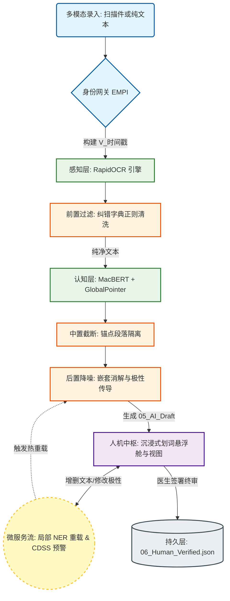

> ### ⚠️ 重要声明 (Disclaimer)
>
> **本项目仅作为毕业设计作品，旨在展示人工智能（NLP）算法落地逻辑、人机协同架构与医疗信息化工程，不具备任何实际医疗用途。**
>
> - **非临床建议**：系统生成的推断结论（如用药目的、临床结论等）均基于预训练模型与专家规则，未经临床验证，**严禁**直接用于真实医疗诊断、用药指导或治疗建议。
> - **学术研究性质**：本项目所有识别结果、推断逻辑仅供学术交流与技术探讨使用，使用者需承担因误用而产生的风险。
> - **数据隐私**：请勿将含有真实敏感个人信息的病历上传至公共环境。
>
> **This project is for academic demonstration purposes ONLY and is NOT intended for actual clinical use or medical diagnosis.**

---

# 🏥 基于 OCR 与大模型 NER 的医疗病历智能结构化与人机协同中枢 
**(Medical EMR Intelligence & Human-in-the-Loop System)**

基于深度学习（MacBERT + GlobalPointer）与动态规则引擎的双驱架构，专为医疗场景设计的自动化信息抽取、逻辑推理与全链路快照归档系统。本项目探索了 AI 算法在垂直行业落地的工程化范式，实现了从静态模型到具备“持续演化”能力的 MLOps 架构跃迁。

---

## 一、 🌟 项目目的与意义 (Project Purpose & Significance)

1. **规范化基层医疗数据资产**：针对非结构化的手写/打印病历，提供低门槛的数字化与结构化解决方案，解决纸质病历易丢失、难检索的痛点。
2. **打通院际信息孤岛**：将杂乱的文本转化为标准结构化 JSON 数据，方便向更高级别医院转院时的病史精准查阅与系统级数据对接。
3. **突破静态 AI 落地局限（核心探索）**：传统的 AI 模型在部署后往往成为“黑盒”，本项目通过引入**主动学习（Active Learning）**与**动态配置**机制，探索了一条轻量级医疗 AI 系统的持续演化路径，有效降低了模型在垂直领域的水土不服。

---

## 二、 ✨ 核心技术突破与工程亮点 (Core Engineering Innovations)

本项目在算法表现层与业务逻辑层实现了多项工业级设计，全面突破了传统静态 NLP 模型的落地瓶颈：

### 2.1 🧠 跨句极性辖域传导 (Polarity Propagation)
- **痛点**：真实病历中常出现“否认心脏病、高血压、糖尿病”的长程连词句式，传统 NER 模型极易产生严重偏离临床事实的“假阳性”提取。
- **创新**：独创“基于枚举正则的极性传染算法”。系统不仅能通过前置滑动窗口捕捉否定词（如“无”、“未见”），更能沿着语法树的枚举节点（如顿号、逗号），将【阴性/排除】状态精准传导至下游所有实体，并在前端 UI 中以**灰色删除线**直观呈现。

### 2.2 🚨 动态微服务与 CDSS 实时预警 (Reactive Microservices & CDSS)
- **痛点**：传统的“批处理”管线在修改单个错字时需要重跑整个流程，算力浪费且交互迟钝。
- **创新**：重构底层引擎为**基于 DAG 的响应式微服务流**。
  - **局部 NER 热重载**：医生在前端增删单段文本时，系统仅将该段落发送至底层大模型显存进行特征解码，实现毫秒级局部无感刷新。
  - **实时临床决策支持 (CDSS)**：内置医药冲突知识图谱（如青霉素交叉过敏、NSAIDs 哮喘）。任何实体状态的改变（算法提取或人工干预）都将瞬间触发网关校验，秒级弹出致命用药冲突的血红色拦截警报。

### 2.3 🎯 自适应坐标重组引擎 (Adaptive Coordinate Alignment)
- **痛点**：在数据复核时，一旦医生增删了底层 OCR 的原始文本，原本提取出的所有实体坐标（start/end）将瞬间全部错位失效。
- **创新**：在前后端构筑了“坐标偏移修复”算法。医生保存修改后的文本时，系统会自动在新文本中重新映射所有实体的绝对坐标。若某实体的宿主词汇被医生删除，该实体标签将极具“生物学特性”地自动湮灭，保证了底层 JSON 数据的绝对纯净。

### 2.4 🖱️ 沉浸式人机协同标注舱 (Immersive MLOps Workspace)
- **痛点**：传统表单式的纠错体验极差，增加了医生的操作负担。
- **创新**：在前端实现了类 iOS 的丝滑交互体验：
  - **划词悬浮菜单**：鼠标划选任意文本，自动精准计算坐标并弹射悬浮气泡，支持一键“设为实体”或“字典纠错”。
  - **实体极性一键翻转**：直接点击高亮实体，即可动态修改类别属性、剔除实体或翻转临床极性，所有操作均实时同步至底层状态机。

---

## 三、 🧠 系统架构与管线工作流 (Architecture & Workflow)

系统采用高度解耦的流水线（Pipeline）设计。以下为本系统的人机协同与数据流转拓扑图：


### 🌊 管线流转解析 (Pipeline Breakdown)

**[多模态感知]**：系统接收病历影像，`app/ocr.py` 驱动引擎提取坐标与文本。随即触发 DataProcessor 进行前置纠错清洗。

**[神经认知推理]**：纯净文本流进入 `app/ner.py`，加载注入了 RoPE 旋转位置编码的 GlobalPointer 网络，在特征空间完成实体张量解码。

**[逻辑处理约束]**：提取出的实体交由规则引擎，执行锚点物理切分与实体黑名单降噪，剔除假阳性数据，输出初步 AI 结构化草案。

**[人机协同干预]**：医生在 Web 智能工作站进行图文溯源比对。如有识别误差，可实时修正并经由 Data Flywheel 反哺底层库。

**[封卷持久化]**：医生补充强制结构化表单（如既往史、过敏史）后提交，系统生成防篡改追踪标签并落库至 `output/` 树状目录。

---

## 四、 📁 目录结构与模块深度解析 (Project Structure)

本项目严格遵循现代软件工程规范，实现了前后端分离、业务代码与配置解耦的底层架构设计。

```text
/Medical_EMR_System/
├── app/                           # 核心推理引擎与处理中枢
│   ├── __init__.py
│   ├── config_manager.py          # [核心] 单例模式配置管家，支撑全链路热重载
│   ├── exceptions.py              # 自定义系统异常类
│   ├── model.py                   # GlobalPointer (带 RoPE 旋转位置编码) 算子结构
│   ├── ner.py                     # MacBERT 认知层推理引擎
│   ├── ocr.py                     # RapidOCR 感知层推理引擎
│   ├── processor.py               # [核心] 逻辑处理管家 (切片、降噪、纠错清洗)
│   └── storage.py                 # 持久层 IO 控制引擎
├── configs/                       # 全局配置集 (解耦算法与业务规则)
│   ├── global_settings.json       # 系统级参数 (硬件调度、存储路径)
│   ├── model.json                 # NER 阈值与标签字典 (支持热更新)
│   └── rules.json                 # 动态规则引擎库 (包含 Data Flywheel 纠错字典)
├── models/                        # 模型权重挂载区
│   └── ner_model.pt               # 基于医疗语料微调的本地张量权重
├── static/                        # 前端静态资源 (分离关注点设计)
│   ├── css/style.css              # 毛玻璃质感 (Glassmorphism) 全局样式表
│   └── js/main.js                 # 动态交互与异步请求脚本 (数据飞轮前端触发器)
├── templates/                     # 视图渲染层
│   └── index.html                 # 智能医疗工作站与人机核对控制台
├── main.py                        # 离线业务流水线构建脚本
├── web.py                         # [入口] Flask 宿主框架与 RESTful API 路由层
└── requirements.txt               # 依赖清单
```

## 五、 🚀 部署与使用指南 (Deployment & Usage)

### 5.1 环境准备
本系统基于 Python 3.9+ 构建，建议使用 Anaconda / Miniconda 创建独立的虚拟环境。
``` bash
# 1. 克隆或下载本项目至本地
# 2. 安装核心运算与应用依赖
pip install -r requirements.txt
```

### 5.2 模型装载
由于平台限制，预训练模型权重需自行挂载：
1. 请确保已将微调后的 ner_model.pt 放置于 `/models/` 目录下。
2. 系统运行前将自动下载 `hfl/chinese-macbert-base` 基础词表（如处于内网离线环境，请提前缓存至本地并在 model.json 中更改寻址路径）。

### 5.3 启动智能中枢
在项目根目录执行以下命令唤起 Web 服务：
```bash
python web.py
```
终端提示 `Running on http://0.0.0.0:5000/` 后，使用现代浏览器（推荐 Chrome / Edge）访问 `http://127.0.0.1:5000/` 即可进入工作站。

### 5.4 操作指南与 MLOps 交互演示
1. **多模态分析与极性审查**：
   - 上传病历图像并启动分析流。
   - 在右侧【语义识别投影】区，**灰色且带有红色(排除)字样并划掉的实体**，代表被系统“极性传导引擎”判定为阴性（如：否认糖尿病）。

2. **沉浸式人机协同干预 (核心操作)**：
   - **划词新增**：用鼠标划选任意黑色文本，系统将自动在光标上方弹射【悬浮舱】。点击“设为实体”并选择类别，即可动态注入新实体。
   - **悬浮纠错**：划选 OCR 识别错误的乱码，点击悬浮舱的“字典纠错”，错词将自动带入输入框，输入正词即可触发数据飞轮反哺底层库。
   - **属性/极性翻转**：直接点击任意已高亮的实体色块，即可在弹窗中一键修改其所属类别（如将症状改为疾病），或一键翻转极性。

3. **微服务流转与自适应坐标重构**：
   - 点击任意段落右上角的 **[✏️ 增删文本]**。
   - 修改或新增原始病历文本后，点击 **[向下传导 (重载 NER 识别本段)]**。系统将**仅把修改后的单段文本**发往底层大模型进行局部重载，并自动对齐所有实体的绝对坐标，实现页面无感刷新。
   - **CDSS 触发测试**：若人为将处方文本修改为“青霉素”，且既往史段落存在“青霉素过敏”字样，系统将实时拦截并爆出红色的高危预警。

4. **终态归档**：确认所有实体与文本逻辑自洽后，点击右下角【确认终态并入库】，生成最终可信的结构化 JSON。

------
## 六、 🔌 开发者文档与 API 参考手册 (Developer Documentation)

为了方便二次开发、学术复现以及与其他医疗信息化系统（如 HIS/LIS）的集成，本系统提供了极其详尽的底层模块说明与微服务接口规范。

关于以下深水区技术细节：
- 基于 DAG 的主干调度器源码逻辑
- 局部 NER 热重载与 CDSS 拦截网关的 RESTful API 入参/出参标准
- NLP 数据处理引擎（极性传导、坐标重构）的函数调用规范
- `window.SYSTEM_CONTEXT` 前后端状态机的数据流转协议

👉 **请参阅深度技术白皮书：[API_REFERENCE.md](docs/API_REFERENCE.md)**

------
## 七、 📚 数据集引用与致谢 (References & Acknowledgements)
本系统在底层算法研究与模型微调阶段，深度依赖了开源社区的贡献，特此致谢：

-   CMeEE-V2 (Chinese Medical Entity Extraction)：感谢 CBLUE 平台提供的中文医疗命名实体识别开源数据集，为本项目的领域适应提供了坚实的数据基座。
-   MacBERT：感谢 HFL (哈工大讯飞联合实验室) 提供的中文预训练语言模型。
-   GlobalPointer：感谢苏剑林大佬提出的全局指针网络思想，优雅地解决了医疗文本的实体嵌套痛点。
-   RapidOCR：感谢跨平台的高效 OCR 开源框架。

------

## 八、 👨‍💻 作者与免责协议 (License)
**开发作者**：SandHit
**使用协议**：仅限学术答辩、技术交流与代码研讨使用。严禁用于任何真实的商业医疗、临床诊断与处方生成场景。